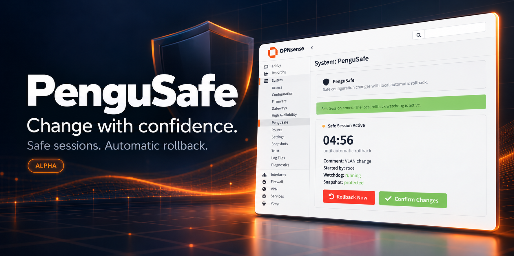

<p align="center">
  
</p>

<h1 align="center">PenguSafe</h1>
<p align="center"><strong>Safe configuration changes with automatic rollback for OPNsense.</strong></p>
<p align="center">
  
  
  
  
</p>

> [!WARNING]
> **ALPHA SOFTWARE — test on a non-production system first.**
> PenguSafe changes and restores the firewall configuration and **reboots
> OPNsense after a successful rollback**. Validate confirmation, manual rollback,
> timeout rollback and boot recovery on a disposable VM before using it on a
> production firewall. Keep an independent configuration backup and console
> access. Recovery is not guaranteed if the firewall, storage or host fails.

## What is PenguSafe?

PenguSafe provides a *commit confirmed* style workflow. Before changing a
working OPNsense configuration, start a Safe Session. PenguSafe copies the
current `config.xml` to a dedicated protected snapshot and starts a watchdog
**locally on the firewall**.

Make and apply your changes using the normal OPNsense pages. If everything
works, confirm before the deadline. If you lose access or do not confirm in
time, PenguSafe restores the snapshot and reboots OPNsense.

Closing the browser does not stop the watchdog. The header countdown is only
an indicator; the local watchdog performs the rollback.

This is an independent community project by
[Borderlane-HA](https://github.com/Borderlane-HA), not an official OPNsense plugin.
The hero is a promotional illustration based on the plugin UI.

## Features

| Feature | Behavior |
| --- | --- |
| Safe Session | Choose 2, 5, 10, 15 or 30 minutes; optionally add a comment. |
| Global timer | A clickable badge in the top-right WebUI header remains available when you navigate to other pages. |
| Countdown warnings | Amber while armed; red in the last minute or when protection needs attention. |
| Unknown status | Connection failures show “Status unknown” rather than a verified countdown. |
| Confirm Changes | Keep the current configuration and cancel this session's automatic rollback. |
| Rollback Now | Immediately restore the protected configuration and schedule a reboot. |
| Automatic rollback | Restore and reboot when the local deadline expires without confirmation. |
| Protected snapshot | Dedicated snapshot, SHA-256 integrity check and restricted filesystem permissions. |
| Boot recovery | Resume an armed session with its original deadline after a firewall reboot. |
| Recent activity | View session events, timestamps, comments and actors. |
| Access controls | Viewing requires the PenguSafe privilege; mutations require full administrator access and a writable account. |
| Safe lifecycle | Source upgrades and uninstall are refused while a session is armed or rolling back. |

## Compatibility and installation type

**Target: OPNsense Community Edition 26.7.5.** The header integration and API
usage were checked against that version's source. Automated checks run in an
isolated environment; this release has **not** been tested end to end on a live
26.7.5 firewall. Other versions and third-party themes are not verified.

The instructions below install source files directly. No `git`, extra Python
package or external runtime is required on OPNsense. The plugin is not listed
in **System → Firmware → Plugins**, and there is no downloadable binary `.pkg`
unless one is separately built and published.

### Install directly from GitHub (no Git required)

Run as **root in the OPNsense SSH/console shell**. On the first publication, the
repository must contain these files on its `main` branch. Use a new staging
directory to avoid mixing releases:

```sh
mkdir -p /root/pengusafe-src
cd /root/pengusafe-src
fetch -o PenguSafe-main.tar.gz https://github.com/Borderlane-HA/PenguSafe/archive/refs/heads/main.tar.gz
tar -xzf PenguSafe-main.tar.gz
cd PenguSafe-main
sh tools/install-dev.sh
```

### Plugin Status

```sh
cd /root/pengusafe-src/PenguSafe-main
configctl pengusafe status
```

The installer validates both header layouts, checks for active sessions, copies
only plugin-owned files, adds the marked header includes, restarts `configd`,
and clears the menu/ACL and compiled-view caches. It does not reboot OPNsense.

## Use a Safe Session

1. Start from a working configuration. Apply or discard unrelated pending edits.
2. Open **System → PenguSafe**, select a timeout and add a useful comment.
3. Click **Start Safe Session**. Verify that the watchdog is running and the
   snapshot is protected.
4. Navigate to the required OPNsense page, make your changes, then save/apply
   them normally. PenguSafe does not apply other pages' pending edits for you.
5. Watch the countdown in the **top-right header**. Click it to return to the
   PenguSafe page from anywhere in the authenticated standard WebUI.
6. Verify network access, routes, VPNs and other affected services.
7. Click **Confirm Changes** before the deadline to keep the configuration, or
   **Rollback Now** to discard all configuration changes since the snapshot.

Confirmation does not apply pending edits; it cancels the protected session.
A rollback restores the **entire snapshot**, including unrelated configuration
changes another administrator made after the session started.

There is only one active Safe Session per firewall. A stale browser tab cannot
confirm or roll back a newer session. Expired sessions cannot be confirmed.

## Global header timer

The badge displays **Idle**, the remaining `MM:SS`, **Rollback due**, or a state
requiring attention. It refreshes status every five seconds while armed and
interpolates the countdown locally between updates. Idle polling uses a
15-second interval. Returning to a background tab triggers a refresh.

Users without access to the PenguSafe status endpoint do not see the badge.
The header never performs a confirmation or rollback itself; clicking it opens
`/ui/pengusafe/`, where the explicit action buttons are available.

### How the global integration works

This alpha adds a small, marked script include to these two core files:

- `/usr/local/www/head.inc` — legacy pages
- `/usr/local/opnsense/mvc/app/views/layouts/default.volt` — MVC pages

The plugin owns the separate JavaScript and CSS assets. The installer does not
replace the complete core headers. Uninstall removes only the marked include
and preserves unrelated edits. Unsupported headers stop the source installer
before it copies plugin files.

A core update may overwrite the includes. The boot hook attempts to reapply
both after reboot. If the badge is missing after an update, finish any active
Safe Session, run the installer again, then hard-refresh. Revalidate
compatibility after each OPNsense upgrade. An unavailable badge does not stop
an already-running watchdog.

## Upgrade

Confirm or roll back any active Safe Session first. Download a fresh release
into a separate directory using either installation method, then run:

```sh
cd /root/pengusafe-src/PenguSafe-main
sh tools/install-dev.sh
```

The same script updates an earlier source install and preserves
`/conf/pengusafe`. It refuses to replace recovery code during an active session.
Log out/in and hard-refresh afterward. Re-run the VM acceptance checks.

## Uninstall

First **confirm or roll back the active Safe Session**. Run the uninstaller
from your retained source directory:

```sh
cd /root/pengusafe-src/PenguSafe-main
sh tools/uninstall-dev.sh
```

If installed from GitHub, use `/root/pengusafe-src/PenguSafe-main` instead.
The uninstaller removes plugin files and marked header includes, stops the
idle watchdog, restarts `configd`, and refreshes caches. It preserves
`/conf/pengusafe` for inspection. Hard-refresh the WebUI afterward.

Only **after successful uninstall**, optionally delete retained snapshots and
history (this cannot be undone):

```sh
rm -rf /conf/pengusafe
```

Do not manually delete recovery scripts or session state while a session is
armed. The protected snapshot can contain secrets from `config.xml`; store
backups securely and never commit runtime state to GitHub.

## How rollback works

1. The manager copies `config.xml` while holding its shared file lock, validates
   the XML and records the snapshot's SHA-256 hash.
2. It persists the session ID, deadline, comment and actor under
   `/conf/pengusafe`, then starts an independent daemon-backed watchdog.
3. The watchdog checks the deadline locally. A reboot does not reset it.
4. Manual or automatic rollback checks the session and snapshot, then calls
   `OPNsense\Core\Config::restoreBackup()` through a local PHP helper.
5. The manager verifies the restored file before scheduling an OPNsense reboot.
   A manual rollback allows about three seconds for the API response to return;
   an automatic rollback schedules the reboot immediately.

The manager serializes mutations with a file lock. The watchdog remains idle
between sessions to avoid a re-arm/exit race and is stopped during uninstall.
A failed restore does not schedule a reboot; the state and error are recorded
for manual investigation.

| Runtime file | Purpose |
| --- | --- |
| `/conf/pengusafe/snapshot.xml` | Configuration protected by the current/latest session |
| `/conf/pengusafe/session.json` | Persistent session state and original deadline |
| `/conf/pengusafe/history.jsonl` | Local activity log |
| `/var/run/pengusafe.pid` | Watchdog process ID; process identity is checked |

## Validate on a non-production VM

Keep console access available and verify all of these before relying on recovery:

1. Arm a two-minute session, confirm, and check that no reboot occurs.
2. Arm a session and navigate to both an MVC page and a legacy page. Confirm
   the header keeps counting and links back to PenguSafe.
3. Change a harmless setting, use **Rollback Now**, and verify after reboot
   that the original value is restored.
4. Repeat the harmless change and let the timer expire without confirmation.
5. Close the browser during a session and verify automatic rollback still runs.
6. Reboot during an armed session and verify that the original deadline resumes.
7. Test a network-breaking change only in a disposable VM with console access.

## Troubleshooting and console recovery

Use **System → Log Files → General** and search for `pengusafe`. Also check:

```sh
configctl pengusafe status
configctl pengusafe history 25
```

The UI disables changes when its status cannot be verified. A missing watchdog,
missing snapshot or `rollback_failed` state needs immediate investigation.
Do not treat the timer alone as proof that recovery is working.

If the GUI is unavailable but you have console access, query the current session
ID from `configctl pengusafe status`, then invoke the manager directly:

```sh
# Replace SESSION_ID with the exact id shown in status.
/usr/local/opnsense/scripts/OPNsense/PenguSafe/pengusafe.py confirm root SESSION_ID
# Or restore the snapshot and reboot:
/usr/local/opnsense/scripts/OPNsense/PenguSafe/pengusafe.py rollback root SESSION_ID
```

If boot recovery reports an interrupted `rolling_back` state, inspect the
configuration and snapshot from the console. This alpha does not automatically
retry interrupted or failed restores. Use the normal OPNsense backup/restore
workflow or your independent backup when necessary.

## Limitations

- Full configuration restore and reboot; no targeted service rollback.
- No HA/CARP or XMLRPC synchronization coordination. Do not rely on it for a
  coordinated rollback across multiple firewalls.
- It restores configuration XML, not installed packages, firmware, external
  files, hypervisor settings or another device's configuration.
- The watchdog needs a running firewall, usable storage and a sane system clock.
  Clock changes can affect the deadline. Power/host failures postpone recovery
  until the firewall can boot again.
- No automatic health checks, auto-confirmation, configuration diff or external
  notifications. The deadline and explicit administrator decision govern rollback.
- Failed/interrupted restores need manual review; no automated retry loop.
- Source installs are not package-managed. Core updates can remove the header
  include; future versions may require adaptation.
- Snapshot protection uses permissions and an integrity hash, not encryption.
- Local history is not automatically rotated. The UI displays the latest 25 events.

## Development and packaging

Run isolated manager/header tests on a development machine:

```sh
python3 tools/selftest.py
node tools/header-selftest.cjs
```

For developer-built packages, place the repository at
`opnsense/plugins/sysutils/pengusafe/` in the official OPNsense plugins tree.
The Makefile imports `../../Mk/plugins.mk`. Build in the OPNsense build
environment; the package hooks install/remove the header integration and refuse
uninstall during an active session. Package builds and lifecycle execution need
separate testing on OPNsense; they are not part of the source-install validation.

Implementation references:
[OPNsense 26.7.5 core](https://github.com/opnsense/core/tree/26.7.5),
[plugin framework](https://github.com/opnsense/plugins),
[backend and syshooks](https://docs.opnsense.org/development/backend.html).

See [CHANGELOG.md](CHANGELOG.md), [docs/VALIDATION.md](docs/VALIDATION.md) and
[docs/GITHUB.md](docs/GITHUB.md) for first-time publication.

## License

[BSD-2-Clause](LICENSE).
